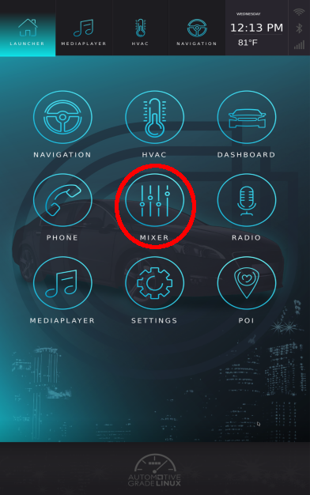
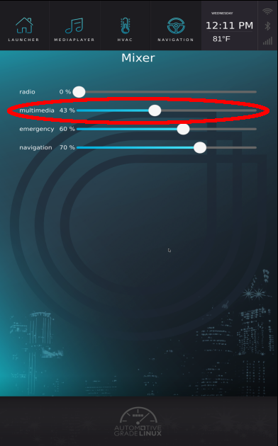

# Play Music

## **Aknowledge roles**

To play music you must know which roles you want to use, for music it's going to
be the multimedia role.

To display the available roles enter:

```bash
4a-api roles
```

## **Play command**

4a-play must be used like this.

```bash
4a-play <file> [role]
```

So in our example it will look like this:

```bash
4a-play Happy_MBB_75.ogg multimedia
```

Where *file* is the path to the file that you want to play, *role* is the role of the 4a-play (multimedia for example).

>**NOTE**: For AGL versions before FF.RC3 you had to specify the device to use. The device that matches with "multimedia" is "hw:0,0,2" (for more details please read the
"Get HALs status" section).
>The command would have been :
> ```bash
> 4a-play Happy_MBB_75.ogg hw:0,0,2 multimedia
> ```

## **Adjust the sound**

Music is too loud ? What about adjusting the sound ?

On the main menu, hit the "Mixer" icon.



Then drag the cursor to change the sound volume of the
wanted role.



## **Play multiple Sounds on different roles**

While your music is playing you might want to simulate an emergency sound, to do
so, in a new terminal, enter:

```bash
4a-play emergencySound.ogg emergency
```

Your music should automatically be lowered so you can hear the emergency sound.
As your emergency sound turns off, your music returns automatically to the
previous volume.

>**NOTE**: For AGL versions before FF.RC3 you had to specify the device to use. The device that matches with "emergency" is "hw:0,0,4" (for more details please read the
"Get HALs status" section).
>The command would have been :
> ```bash
> 4a-play emergencySound.ogg hw:0,0,4 emergency
> ```